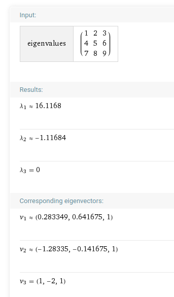

假设矩阵 A = [[1,2,3],[4,5,6],[7,8,9]]

最近在看一篇论文，https://arxiv.org/abs/1908.03795 里面有一个公式：

我按照这个验证，发现对不上。

( abs( v_{3,1} ) ^ 2 ) * 16.1168 * (-1.11684) == lambda_1([[5,6],[8,9]]) * lambda_2([[5,6],[8,9]])

1 * 16.1168 * (-1.11684) == 49 - 4*13

-18 == -3

验证失败。

论文肯定不会有错的，我的步骤哪里出问题了吗？

还有，按照这篇论文，如果已知一个 N * N 的矩阵 A 的 n 个本征值，如何求解出对应的 n 个本征矢呢，能不能就以上面的A做一个具体的范例？

小工具：在 https://www.wolframalpha.com 可以计算矩阵本征值： Eigenvalues[{{1,2,3},{4,5,6},{7,8,9}}] 

