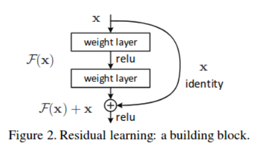
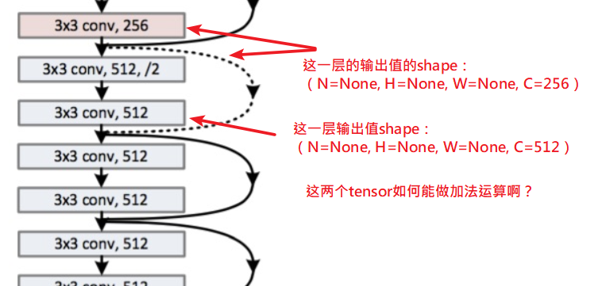

# Question

## Answer3:

我最近参加的是 Data Castle 的"地球物候预测"和"中兴神算师"

感觉有好多比赛都玩不了，比如华为最近的网络精英挑战赛，车辆调度，说实话题目都看不懂。还有中兴的神算师那几个题目，可以说和ai/ml没关系，好像和邓俊辉老师的数据结构课程也没关系，这次倒是能看懂几个题目，正在尝试做。

昨天接到一个1h以上的面试电话，还是第一次打这么长时间的电话呢。。。    可能会通过吧，不过我老板明确表明，即使延期，就算在学校呆着什么也不干也不能出去实习。。。(嗯，我们劝退专业的一些事情你可能不是很了解)

鉴于paper差不多快完成了，大概下个月以后可以有更多时间学习。最近在反思，好像不能只玩这类，用tensorflow/sklearn/xgboost就可以玩的比赛。而且感觉cv/ai/ml的科班生越来越多。可能不应该朝着ai/cv跑。嗯，总之一切为了3~4个月后的秋招。

---

[kaggle](https://www.kaggle.com/)

[天池](https://tianchi.aliyun.com/)

[Data Castle](http://www.pkbigdata.com/): [DC竞赛页面](http://www.dcjingsai.com), [DC直聘页面](http://www.pkbigdata.com/static_page/jobPage/cd_jobIndex.html)

[DataFountain](https://www.datafountain.cn)

除了平台赛之外，BATJ等大厂都会定期举办数据/机器学习的旗舰赛事，通常一年一度：

[华为 - 人工智能校园创新大赛](https://developer.huawei.com/consumer/cn/devservice/activity/devStarAI/list)
截止时间:2019-06-20，03-15开启，每天应该去看看。感觉不合适，是要求自主开发一款app作为提交作品，这就搞不了了。
https://developer.huawei.com/consumer/cn/devservice/activity/devStarAI/info/698

[天池 - 津南数字制造算法挑战赛【赛场二】](https://tianchi.aliyun.com/competition/entrance/231703/forum)

图像比赛，检测/分割，数据量不大，，，但是还剩几天初赛就结束了，等下一次机会吧。

[腾讯赛](http://tpai.qq.com/race)

[滴滴赛](http://research.xiaojukeji.com)

[京东JDD](https://jdder.jd.com)

[京东JDATA](https://jdata.jd.com/index.html)

[蚂蚁金服赛](https://dc.cloud.alipay.com/index)

[百度点石](https://dianshi.baidu.com/competition)

[爱奇艺AI竞赛](http://challenge.ai.iqiyi.com/)
有一个比赛，视频类，数据量约20G，玩不起。。

## Question2:

我最近参加了这个比赛，不知道你有没有兴趣啊？
我遇到很多困难，感觉是主办方给了一个无解的题目。

http://www.dcjingsai.com 地球物候的深度学习预测

http://www.dcjingsai.com/common/cmpt/%E5%9C%B0%E7%90%83%E7%89%A9%E5%80%99%E7%9A%84%E6%B7%B1%E5%BA%A6%E5%AD%A6%E4%B9%A0%E9%A2%84%E6%B5%8B_%E7%AB%9E%E8%B5%9B%E4%BF%A1%E6%81%AF.html

这是一个时空序列预测任务，每一个时间点都会给一张卫星灰度图片（1200\*1200\*1），图片表示植被发育情况。给大约200张这样的图片，要预测之后的几张图片的样子。

en，以上是一个地区的情况，每一个地区有大约200张图片，要预测之后的几张图片。现在是初赛，一共有4个地区的数据(也就是说现在有约800张图片)，决赛的话主办方会给更多的数据的。

我的思路是用convlstm[1,2]来做。

>[1] Convolutional LSTM Network: A Machine Learning Approach for Precipitation Nowcasting，http://arxiv.org/abs/1506.04214
>
>这篇2015.06.12的paper提出convlstm结构来预测降水。

>[2] Air Quality Forecasting Using Convolutional LSTM，https://cs230.stanford.edu/projects_spring_2018/reports/8291197.pdf
>
>这是吴恩达的2018年cs230春季课程的一个report，用convlstm来预测空气质量。

## Question1:
关于resnet的结构

